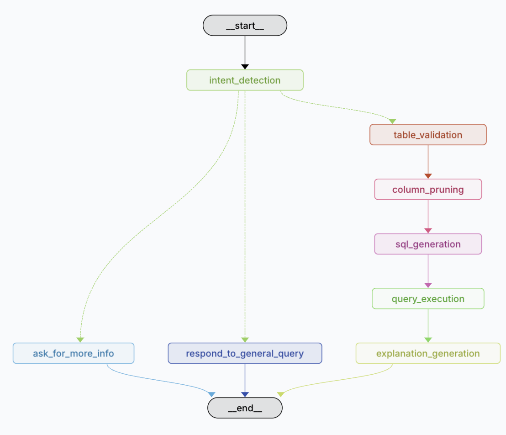

# LangGraph Postgres Energy Data

Este proyecto utiliza **LangGraph** para construir un flujo de trabajo que permite consultar una base de datos PostgreSQL con datos de consumo energético. Se implementa un agente basado en **LangChain** que clasifica la intención del usuario, genera consultas SQL relevantes y proporciona respuestas explicativas.

## 🚀 Características

- **Clasificación de intención:** Determina si la consulta requiere acceso a la base de datos o una respuesta general.
- **Generación de SQL:** Construcción dinámica de consultas SQL basadas en el input del usuario.
- **Ejecución de consultas:** Conexión a PostgreSQL y recuperación de datos.
- **Explicación de resultados:** Generación de una descripción comprensible de la consulta y los resultados.
- **Interacción con LLMs:** Uso de `ChatOpenAI` para procesamiento de lenguaje.

## 📁 Estructura del Proyecto

```plaintext
langgraph-postgres-energy-data/
│── agent/
│   ├── configuration.py   # Configuración del agente
│   ├── state.py           # Definición de estados y router
│   ├── prompts.py         # Definición de model prompts
│   ├── utils.py           # Funciones auxiliares
│   ├── graph.py           # Definición del grafo de ejecución
│── requirements.txt       # Dependencias del proyecto
│── README.md              # Documentación del proyecto
```

## ⚙️ Instalación

```sh
git clone https://github.com/tuusuario/langgraph-postgres-energy-data.git
cd langgraph-postgres-energy-data
python -m venv venv
source venv/bin/activate  # En Windows usa `venv\Scripts\activate`
pip install -e .
```

## 🏗️ Uso

Ejecuta el flujo de trabajo principal:

```sh
python main.py
```

## 🛠️ Configuración

Modifica `agent/configuration.py` para ajustar los prompts y la conexión a la base de datos:

```python
DB_CONFIG = {
    "dbname": "smart_city_db",
    "user": "your_user",
    "password": "your_password",
    "host": "your_host",
    "port": "5432"
}
```

## 🧩 Funcionamiento

1. **Clasificación de intención**: Se analiza la consulta del usuario para determinar si es general o requiere una consulta SQL.
2. **Validación de tabla**: Se identifica la tabla relevante (`building_energy_consumption`).
3. **Selección de columnas**: Se filtran las columnas necesarias para responder la consulta.
4. **Generación de SQL**: Se construye la consulta SQL basada en el input del usuario.
5. **Ejecución en PostgreSQL**: Se conecta a la base de datos y obtiene los resultados.
6. **Generación de explicación**: Se genera una descripción en lenguaje natural del resultado.

## 📝 Notas

- **Seguridad**: No expongas credenciales de la base de datos en código.
- **Extensibilidad**: Se pueden agregar más tablas o mejorar el enrutamiento de consultas.
- **Integración con APIs**: Se puede conectar con otros servicios para ampliar su funcionalidad.

## 📜 Licencia

Este proyecto está bajo la licencia MIT. Consulta el archivo `LICENSE` para más detalles.
